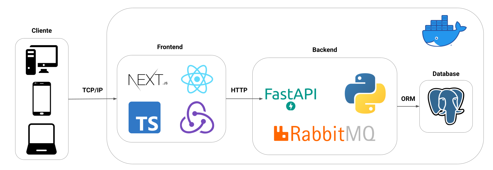
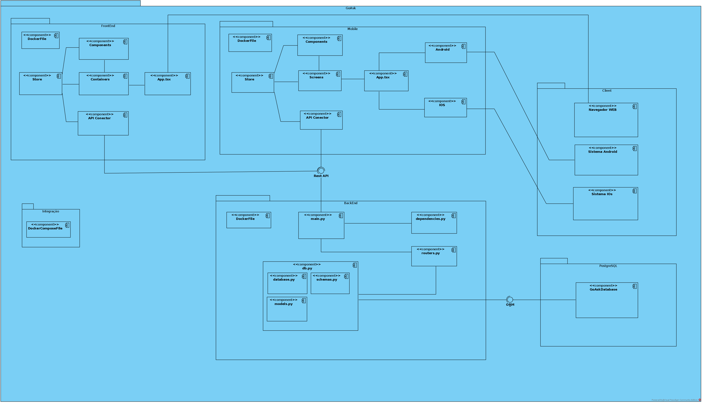

# GoAsk

**Guilherme Campos Barata Diniz, dinizwalker@gmail.com**

**Guilherme Oliveira Antonio, gantonio@sga.pucminas.br**

**Matheus Felipe Ferreira Martins, matheus.martins.1215641@sga.pucminas.br**

**Ricardo Christovão da Silva, ricardo.christovao@sga.pucminas.br**

**Thiago Jorge Queiroz Silva, thiago.queiroz@sga.pucminas.br**

---

Professores:

**Prof. Hugo Bastos de Paula**

**Prof. Pedro Alves De Oliveira**

---

_Curso de Engenharia de Software, Unidade Praça da Liberdade_

_Instituto de Informática e Ciências Exatas – Pontifícia Universidade de Minas Gerais (PUC MINAS), Belo Horizonte – MG – Brasil_

---

_**Resumo**. Escrever aqui o resumo. O resumo deve contextualizar rapidamente o trabalho, descrever seu objetivo e, ao final,
mostrar algum resultado relevante do trabalho (até 10 linhas)._

---

## Histórico de Revisões

| **Data**         | **Autor**                                             | **Descrição**                                                                                                     | **Versão** |
| ---------------- | ----------------------------------------------------- | ----------------------------------------------------------------------------------------------------------------- | ---------- |
| **[24/02/2021]** | [Matheus Felipe]                                      | [Adição dos nomes dos autores e descrição dos objetivos do projeto na seção 1.2]                                  | [1.0]      |
| **[24/02/2021]** | [Thiago Silva]                                        | [Descrição da apresentação do projeto na seção 1]                                                                 | [1.1]      |
| **[25/02/2021]** | [Thiago Silva]                                        | [Adição dos e-mails dos autores, descrição do problema na seção 1.1 e preenchimento de abreviaturas na seção 1.3] | [1.2]      |
| **[28/02/2021]** | [Guilherme Diniz, Guilherme Oliveira, Matheus Felipe] | [Adição de requistos]                                                                                             | [2.0]      |
| **[03/03/2021]** | [Matheus Felipe]                                      | [Correção dos objetivos e requisitos não funcionais]                                                              | [2.1]      |
| **[03/03/2021]** | [Matheus Felipe]                                      | [Restrições arquiteturais]                                                                                        | [2.2]      |
| **[04/03/2021]** | [Thiago Silva]                                        | [Correção da Apresentação e Problema]                                                                             | [2.3]      |

## SUMÁRIO

1. [Apresentação](#apresentacao "Apresentação")  
   1.1. Problema  
   1.2. Objetivos do trabalho  
   1.3. Definições e Abreviaturas  

2. [Requisitos](#requisitos "Requisitos")  
   ' 2.1. Requisitos Funcionais  
   2.2. Requisitos Não-Funcionais  
   2.3. Restrições Arquiteturais  
   2.4. Mecanismos Arquiteturais  

3. [Modelagem](#modelagem "Modelagem e projeto arquitetural")  
   3.1. Visão de Negócio  
   3.2. Visão Lógica  
   3.3. Modelo de dados (opcional)  

4. [Avaliação](#avaliacao "Avaliação da Arquitetura")  
   4.1. Cenários  
   4.2. Avaliação  

5. [Referências](#referencias "REFERÊNCIAS") 

6. [Apêndices](#apendices "APÊNDICES") 

# 1. Apresentação

Com os avanços tecnológicos a maneira das pessoas viverem e levarem o seu dia a dia mudou e continua mudando de maneira gradativa. Os avanços computacionais trouxeram mais simplicidade e facilidade para o cotidiano das pessoas que tem acesso a esse tipo de tecnologia, algumas evidencias disso podem ser encontradas pelo fato de as pessoas estarem muito mais conectadas entre si independente da distância, as empresas conseguirem contratar e se relacionar com seus trabalhadores através da internet e também como uma grande ajuda em se tratado da educação e busca de conhecimento.  

Em se tratando de educação a internet vem ajudando estudantes principalmente por trazer um fácil acesso a informações como artigos e matérias que auxiliam no aprendizado dos mesmos. Existem também outras utilidades da internet para os estudantes como por exemplo as vídeo aulas e aulas online que servem como um material muito importante na evolução do indivíduo. Com o surgimento do corona vírus em 2019 cada vez mais países, inclusive o Brasil, estão tendo que buscar medidas para impedir o aglomeramento de pessoas como o fechamento de escolas e assim migrando as aulas de presenciais para aulas online. 

Porem o processo de adaptação a esse novo modelo de ensino não tem sido fácil para muitos alunos, que apresentam dificuldades para acompanhar as aulas, e professores, que tem dificuldade em atrair a atenção do aluno e acompanhar como está a evolução de sua turma em relação ao conteúdo. Visto isso o GoAsk vem com o propósito de facilitar a vida para esses alunos e professores com uma proposta de quizes que estimulem a competitividade entre os alunos e facilitem ao mesmo tempo o entendimento do professor sobre o que os alunos entenderam sobre o conteúdo. 

## 1.1. Problema

Diante da pandemia do corona vírus as escolas e faculdades no Brasil tiveram que se adaptar à nova realidade, tornando então necessário que ocorresse uma adaptação da mesma migrando de aulas presenciais para aulas virtuais. Porém essa adaptação não tem sido fácil nem para os professores e nem para os alunos enquanto alunos possuem uma dificuldade maior para concentrar durante as aulas, os professores se deparam com a falta de opções para dar uma aula que pudesse provocar interesse e uma maior interação do aluno com aula.     

Com esse novo modelo de aula muitos alunos desanimados acabam por faltar muito as aulas e irem dando cada vez menos importância para as aulas, com isso as aulas ficam cada vez mais paradas e com menos interações de alunos o que afeta no processo de aprendizagem e amadurecimento do aluno e ao mesmo tempo dificulta ainda mais o sucesso da missão do professor em repassar seu conhecimento e amadurecer seus alunos.  

Visto isso os professores possuem a missão de tentar despertar o interesse a atenção de seus alunos durante as aulas para que o aprendizado de seus alunos seja maior. O acompanhamento do estudante passou a ser também uma tarefa mais complicada visto que os professores virtualmente possuem uma dificuldade maior em avaliar os conhecimentos dos alunos e saber se estão em dia com a matéria. Assim professores precisam ser criativos para fazer com que os seus alunos se interessarem pela aula. Com isso os professores acabam buscando softwares que possam auxilia-los nessa missão. 

## 1.2. Objetivos do trabalho

Este projeto tem como objetivo principal tornar o aprendizado mais descontraído, leve e autônomo, por meio de um módulo web que permita a administração de quizes onlines nos quais se comunicam por um módulo mobile em que qualquer usuário poderá participar e desafiar esse quiz a partir de um código gerado pela aplicação. Para alcançar isso, o projeto tem alguns objetivos específicos:

- Auxiliar a avaliação do conhecimento de um grupo de pessoas por meio da implementação de um sistema de pontuação e classificação para cada teste criado, que inclui o uso de um módulo de persistência que armazena jogadores, pontuações e quizes jogados para que ao final do jogo, exiba a colocação final na interface de apresentação ao usuário.
- Desenvolver habilidades sociais por meio da curiosidade e aprendizado, uma vez que este trabalho implementa um sistema distribuído que permitirá a concorrência de vários jogadores em um mesmo quiz, podendo ser amigos ou anônimos.
- Criar artefatos que auxiliem no processo de desenvolvimento da aplicação, como a modelagem das classes e o desenho das interfaces que irão compor o sistema;

- Projetar a arquitetura do software para reduzir riscos associados ao projeto e sua manutenção, alinhando expectativas e modelando o sistema com qualidade e flexibilidade.

## 1.3. Definições e Abreviaturas

REST(Repesentional State Transfer) - O REST é um estilo arquitetural que tem como objetivo principal a definição de características fundamentais para a construção de aplicações Web seguindo boas práticas e construindo aplicações escaláveis.

PK(Primary Key) - A sigla PK representa uma associação que é feita a um atributo de alguma tabela no banco de dados onde cada tabela só pode possuir uma PK única, que será utilizada para localizar o elemento na tabela.

FK(Foreign Key) - A sigla FK representa uma associação que é feita a um atributo de alguma tabela, no banco de dados, que liga uma tabela A a uma tabela B por exemplo assim a FK de um elemento da tabela A será a PK do elemento na tabela B.

# 2. Requisitos

Esta seção descreve os requisitos comtemplados no projeto GoAsk.

## 2.1. Requisitos Funcionais

| **ID** | **Descrição**                                                                           | **Prioridade** |
| ------ | --------------------------------------------------------------------------------------- | -------------- |
| RF001  | O usuário deve ser capaz de cadastrar uma conta pela interface web.                     | Essencial      |
| RF002  | O usuário deve ser capaz de entrar em uma conta cadastrada pela interface web.          | Essencial      |
| RF003  | O usuário deve ser capaz de cadastrar um quiz pela interface web.                       | Essencial      |
| RF004  | O usuário deve ser capaz de entrar em um quiz pela interface mobile.                    | Essencial      |
| RF005  | O usuário deve ser capaz de responder as questões do quiz que está participando.        | Essencial      |
| RF006  | O usuário deve ser capaz de editar o quiz pela interface web.                           | Desejável      |
| RF007  | O usuário deve ser capaz de ver estatísticas de seu quiz pela interface web.            | Desejável      |
| RF008  | O usuário deve ser capaz de ver o resultado após responder uma pergunta do quiz.        | Desejável      |
| RF009  | O usuário deve ser capaz de ver o ranking de colocação final de um quiz.                | Desejável      |
| RF010  | O usuário deve ser capaz de deletar um quiz criado pela interface web.                  | Desejável      |
| RF011  | O usuário deve ser capaz de editar seus dados pela interface web.                       | Opcional       |
| RF012  | O usuário deve ser capaz de visualizar salas de quiz ativas pela interface mobile.      | Opcional       |
| RF013  | O usuário deve ser capaz escolher a visibilidade de seu quiz criado pela interface web. | Opcional       |

## 2.2. Requisitos Não-Funcionais

| **ID** | **Descrição**                                                                                                               |
| ------ | --------------------------------------------------------------------------------------------------------------------------- |
| RNF001 | O sistema deve exibir a sala ou uma mensagem de sala não encontrada no máximo 5 segundos após o usuário digitar seu código. |
| RNF002 | O sistema deverá persistir as senhas de seus usuários de modo criptografado                                                 |
| RNF003 | O sistema deve ser responsivo para adaptar a diferentes medidas de layout                                                   |

## 2.3. Restrições Arquiteturais

As restrições arquiteturais impostas ao projeto são:

- A api do software deverá ser desenvolvido em Python/FastApi;
  
- A comunicação da API deve seguir o padrão RESTful.

- A interface web deve ser uma single page application desenvolvida em React.
  
- O cliente e o servidor devem ser capazes de serem desenvolvidas e alteradas separadamente, sem qualquer dependência um do outro, desde que haja uma conexão.

## 2.4. Mecanismos Arquiteturais

| **Análise**       | **Design**                                 | **Implementação**             |
| ----------------- | ------------------------------------------ | ----------------------------- |
| Persistência      | ORM                                        | PostgreSQL + SqlAlchemy       |
| Front end         | WEB                                        | ReactJS + Typescript + NextJs |
| Mobile            | IOs + Android                              | ReactNative + Typescript      |
| Back end          | API RESTful                                | FastAPI                       |
| Integração        | Entrega contínua com pipelines automáticos | Heroku + GitHub + Netlify     |
| Log do sistema    | Logs em produção                           | FastAPI                       |
| Teste de Software | Testes unitários                           | Python unittest + Jest        |
| Deploy            | Cointainers Docker                         | Docker + Heroku + Netlify     |

# 3. Modelagem e projeto arquitetural

_Apresente uma visão geral da solução proposta para o projeto e explique brevemente esse diagrama de visão geral, de forma textual. Esse diagrama não precisa seguir os padrões da UML, e deve ser completo e tão simples quanto possível, apresentando a macroarquitetura da solução._

**Figura 1 - Visão Geral da Solução (fonte: https://medium.com)**

Obs: substitua esta imagem por outra, adequada ao seu projeto (cada arquitetura é única).

## 3.1. Visão de Negócio (Funcionalidades)

_Apresente uma lista simples com as funcionalidades previstas no projeto (escopo do produto)._

1. O sistema deve...
2. O sistema deve...
3. ...

Obs: a quantidade e o escopo das funcionalidades deve ser negociado com os professores/orientadores do trabalho.

### Descrição resumida dos Casos de Uso / Histórias de Usuário

_Nesta seção, os casos de uso devem ser resumidos. Esse detalhamento pode ser na forma de um texto sintético ou, alternativamente, você pode optar por descrever estórias de usuários seguindo os métodos ágeis. Neste caso a seção deve chamar &quot;Histórias de usuários&quot;. Lembre-se das características de qualidade das estórias de usuários, ou seja, o que é preciso para descrever boas histórias de usuários._

Exemplos de resumo de Casos de Uso:

#### UC01 – NOME DO CASO DE USO 01

| **Descrição**             |     |
| ------------------------- | --- |
| **Atores**                |     |
| **Prioridade**            |     |
| **Requisitos associados** |     |
| **Fluxo Principal**       |     |

#### UC02 – NOME DO CASO DE USO 02

| **Descrição**             |     |
| ------------------------- | --- |
| **Atores**                |     |
| **Prioridade**            |     |
| **Requisitos associados** |     |
| **Fluxo Principal**       |     |

Exemplos de Histórias de Usuário:

- Como Fulano eu quero poder convidar meus amigos para que a gente possa se reunir...

- Como Cicrano eu quero poder organizar minhas tarefas diárias, para que...

- Como gerente eu quero conseguir entender o progresso do trabalho do meu time, para que eu possa ter relatórios periódicos dos nossos acertos e falhas.

## 3.2. Visão Lógica

_Apresente os artefatos que serão utilizados descrevendo em linhas gerais as motivações que levaram a equipe a utilizar estes diagramas._

### Diagrama de Classes

**Figura 2 – Diagrama de classes (exemplo). Fonte: o próprio autor.**

Obs: Acrescente uma breve descrição sobre o diagrama apresentado na Figura 3.

### Diagrama de componentes

_Apresente o diagrama de componentes da aplicação, indicando, os elementos da arquitetura e as interfaces entre eles. Liste os estilos/padrões arquiteturais utilizados e faça uma descrição sucinta dos componentes indicando o papel de cada um deles dentro da arquitetura/estilo/padrão arquitetural. Indique também quais componentes serão reutilizados (navegadores, SGBDs, middlewares, etc), quais componentes serão adquiridos por serem proprietários e quais componentes precisam ser desenvolvidos._

**Figura 3 – Diagrama de Componentes (exemplo). Fonte: o próprio autor.**

_Apresente uma descrição detalhada dos artefatos que constituem o diagrama de implantação._

Ex: conforme diagrama apresentado na Figura X, as entidades participantes da solução são:

- **Componente 1** - Lorem ipsum dolor sit amet, consectetur adipiscing elit. Cras nunc magna, accumsan eget porta a, tincidunt sed mauris. Suspendisse orci nulla, sagittis a lorem laoreet, tincidunt imperdiet ipsum. Morbi malesuada pretium suscipit.
- **Componente 2** - Praesent nec nisi hendrerit, ullamcorper tortor non, rutrum sem. In non lectus tortor. Nulla vel tincidunt eros.

## 3.3. Modelo de dados (opcional)

_Caso julgue necessário para explicar a arquitetura, apresente o diagrama de classes ou diagrama de Entidade/Relacionamentos ou tabelas do banco de dados. Este modelo pode ser essencial caso a arquitetura utilize uma solução de banco de dados distribuídos ou um banco NoSQL._

 ")

**Figura 4 – Diagrama de Entidade Relacionamento (ER) - exemplo. Fonte: o próprio autor.**

Obs: Acrescente uma breve descrição sobre o diagrama apresentado na Figura 3.

# 4. Avaliação da Arquitetura

_Esta seção descreve a avaliação da arquitetura apresentada, baseada no método ATAM._

## 4.1. Cenários

_Apresente os cenários de testes utilizados na realização dos testes da sua aplicação. Escolha cenários de testes que demonstrem os requisitos não funcionais sendo satisfeitos. Os requisitos a seguir são apenas exemplos de possíveis requisitos, devendo ser revistos, adequados a cada projeto e complementados de forma a terem uma especificação completa e auto-explicativa._

**Cenário 1 - Acessibilidade:** Suspendisse consequat consectetur velit. Sed sem risus, dictum dictum facilisis vitae, commodo quis leo. Vivamus nulla sem, cursus a mollis quis, interdum at nulla. Nullam dictum congue mauris. Praesent nec nisi hendrerit, ullamcorper tortor non, rutrum sem. In non lectus tortor. Nulla vel tincidunt eros.

**Cenário 2 - Interoperabilidade:** Pellentesque habitant morbi tristique senectus et netus et malesuada fames ac turpis egestas. Fusce ut accumsan erat. Pellentesque in enim tempus, iaculis sem in, semper arcu.

**Cenário 3 - Manutenibilidade:** Phasellus magna tellus, consectetur quis scelerisque eget, ultricies eu ligula. Sed rhoncus fermentum nisi, a ullamcorper leo fringilla id. Nulla lacinia sem vel magna ornare, non tincidunt ipsum rhoncus. Nam euismod semper ante id tristique. Mauris vel elit augue.

**Cenário 4 - Segurança:** Suspendisse consectetur porta tortor non convallis. Sed lobortis erat sed dignissim dignissim. Nunc eleifend elit et aliquet imperdiet. Ut eu quam at lacus tincidunt fringilla eget maximus metus. Praesent finibus, sapien eget molestie porta, neque turpis congue risus, vel porttitor sapien tortor ac nulla. Aliquam erat volutpat.

## 4.2. Avaliação

_Apresente as medidas registradas na coleta de dados. O que não for possível quantificar apresente uma justificativa baseada em evidências qualitativas que suportam o atendimento do requisito não-funcional. Apresente uma avaliação geral da arquitetura indicando os pontos fortes e as limitações da arquitetura proposta._

| **Atributo de Qualidade:** | Segurança                                                                                                                                                                                                                                                              |
| -------------------------- | ---------------------------------------------------------------------------------------------------------------------------------------------------------------------------------------------------------------------------------------------------------------------- |
| **Requisito de Qualidade** | Acesso aos recursos restritos deve ser controlado                                                                                                                                                                                                                      |
| **Preocupação:**           | Os acessos de usuários devem ser controlados de forma que cada um tenha acesso apenas aos recursos condizentes as suas credenciais.                                                                                                                                    |
| **Cenários(s):**           | Cenário 4                                                                                                                                                                                                                                                              |
| **Ambiente:**              | Sistema em operação normal                                                                                                                                                                                                                                             |
| **Estímulo:**              | Acesso do administrador do sistema as funcionalidades de cadastro de novos produtos e exclusão de produtos.                                                                                                                                                            |
| **Mecanismo:**             | O servidor de aplicação (Rails) gera um _token_ de acesso para o usuário que se autentica no sistema. Este _token_ é transferido para a camada de visualização (Angular) após a autenticação e o tratamento visual das funcionalidades podem ser tratados neste nível. |
| **Medida de Resposta:**    | As áreas restritas do sistema devem ser disponibilizadas apenas quando há o acesso de usuários credenciados.                                                                                                                                                           |

**Considerações sobre a arquitetura:**

| **Riscos:**                  | Não existe |
| ---------------------------- | ---------- |
| **Pontos de Sensibilidade:** | Não existe |
| _ **Tradeoff** _ **:**       | Não existe |

Evidências dos testes realizados

_Apresente imagens, descreva os testes de tal forma que se comprove a realização da avaliação._

# 5. REFERÊNCIAS

_Como um projeto da arquitetura de uma aplicação não requer revisão bibliográfica, a inclusão das referências não é obrigatória. No entanto, caso você deseje incluir referências relacionadas às tecnologias, padrões, ou metodologias que serão usadas no seu trabalho, relacione-as de acordo com a ABNT._

Verifique no link abaixo como devem ser as referências no padrão ABNT:

http://www.pucminas.br/imagedb/documento/DOC\_DSC\_NOME\_ARQUI20160217102425.pdf

**[1]** - _ELMASRI, Ramez; NAVATHE, Sham. **Sistemas de banco de dados**. 7. ed. São Paulo: Pearson, c2019. E-book. ISBN 9788543025001._

**[2]** - _COPPIN, Ben. **Inteligência artificial**. Rio de Janeiro, RJ: LTC, c2010. E-book. ISBN 978-85-216-2936-8._

**[3]** - _CORMEN, Thomas H. et al. **Algoritmos: teoria e prática**. Rio de Janeiro, RJ: Elsevier, Campus, c2012. xvi, 926 p. ISBN 9788535236996._

**[4]** - _SUTHERLAND, Jeffrey Victor. **Scrum: a arte de fazer o dobro do trabalho na metade do tempo**. 2. ed. rev. São Paulo, SP: Leya, 2016. 236, [4] p. ISBN 9788544104514._

**[5]** - _RUSSELL, Stuart J.; NORVIG, Peter. **Inteligência artificial**. Rio de Janeiro: Elsevier, c2013. xxi, 988 p. ISBN 9788535237016._

# 6. APÊNDICES

_Inclua o URL do repositório (Github, Bitbucket, etc) onde você armazenou o código da sua prova de conceito/protótipo arquitetural da aplicação como anexos. A inclusão da URL desse repositório de código servirá como base para garantir a autenticidade dos trabalhos._
