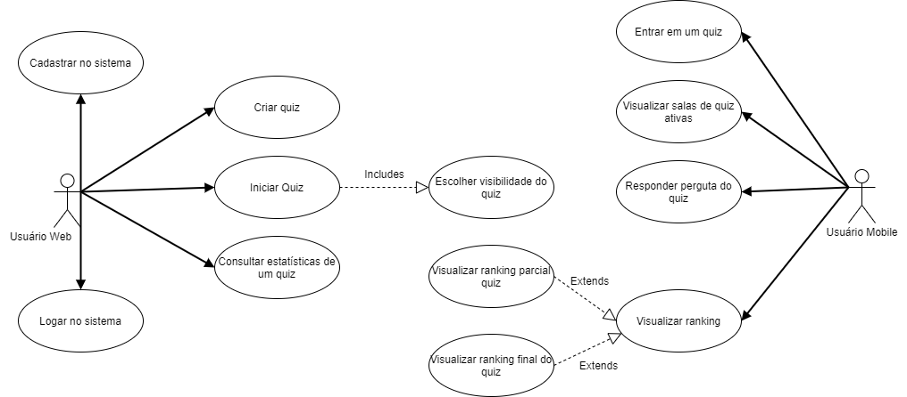
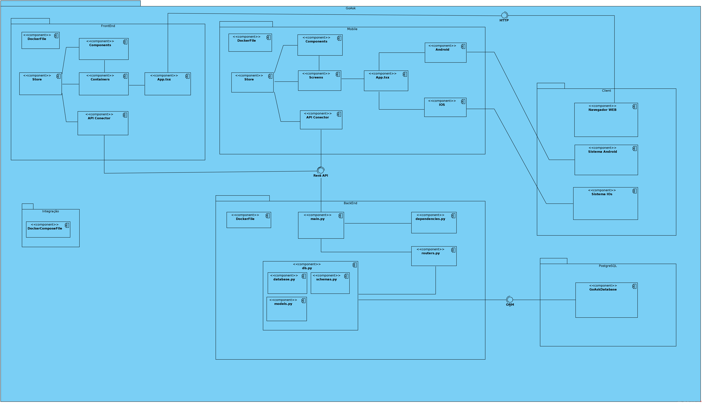
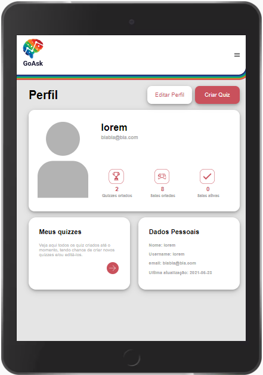

# GoAsk

**Guilherme Campos Barata Diniz, dinizwalker@gmail.com**

**Guilherme Oliveira Antonio, gantonio@sga.pucminas.br**

**Matheus Felipe Ferreira Martins, matheus.martins.1215641@sga.pucminas.br**

**Ricardo Christovão da Silva, ricardo.christovao@sga.pucminas.br**

**Thiago Jorge Queiroz Silva, thiago.queiroz@sga.pucminas.br**

---

Professores:

**Prof. Hugo Bastos de Paula**

**Prof. Pedro Alves De Oliveira**

---

_Curso de Engenharia de Software, Unidade Praça da Liberdade_

_Instituto de Informática e Ciências Exatas – Pontifícia Universidade de Minas Gerais (PUC MINAS), Belo Horizonte – MG – Brasil_

---

_**Resumo**. O GoAsk é um sistema que busca fortalecer o relacionamento entre a tecnologia e os estudos sobre qualquer assunto, a fim de resolver problemas de nivelamento entre os estudantes, distrações externas e repetições de cenários. Para alcançar esse objetivo, o GoAsk fornecerá um sistema web que permitirá a administração de quizes ou testes rápidos com uma liberdade de escolha de tema e tempo para responder as perguntas criadas, qualquer um poderá usar essa ferramenta, seja professores, assistentes ou os próprios estudantes que pretendem ensinar, aprender ou simplesmente se divertir. O sistema também fornecerá uma versão mobile no qual diversos usuários podem acessar a sala de um quiz e concorrerem entre si e contra o tempo, com um sistema de pontuação que exibe um ranking de colocoção dos participantes. Enfim, o GoAsk tem como missão tornar o aprendizado mais descontraído, leve e autônomo, que permita momentos de diversão e trívia com amigos e desenvolva habilidades técnicas e sociais por meio da curiosidade e brincadeira para todos seus usuários e todos assuntos._

---

## Histórico de Revisões

| **Data**         | **Autor**                                             | **Descrição**                                                                                                     | **Versão** |
| ---------------- | ----------------------------------------------------- | ----------------------------------------------------------------------------------------------------------------- | ---------- |
| **[24/02/2021]** | [Matheus Felipe]                                      | [Adição dos nomes dos autores e descrição dos objetivos do projeto na seção 1.2]                                  | [1.0]      |
| **[24/02/2021]** | [Thiago Silva]                                        | [Descrição da apresentação do projeto na seção 1]                                                                 | [1.1]      |
| **[25/02/2021]** | [Thiago Silva]                                        | [Adição dos e-mails dos autores, descrição do problema na seção 1.1 e preenchimento de abreviaturas na seção 1.3] | [1.2]      |
| **[28/02/2021]** | [Guilherme Diniz, Guilherme Oliveira, Matheus Felipe] | [Adição de requistos]                                                                                             | [2.0]      |
| **[03/03/2021]** | [Matheus Felipe]                                      | [Correção dos objetivos e requisitos não funcionais]                                                              | [2.1]      |
| **[03/03/2021]** | [Matheus Felipe]                                      | [Restrições arquiteturais]                                                                                        | [2.2]      |
| **[04/03/2021]** | [Thiago Silva]                                        | [Correção da Apresentação e Problema]                                                                             | [2.3]      |
| **[10/03/2021]** | [Matheus Felipe]                                      | [Revisão de objetivos e requisitos]                                                                               | [3.0]      |
| **[17/03/2021]** | [Guilherme Diniz ]                                    | [Modelo de Dados]                                                                                                 | [4.1]      |
| **[17/03/2021]** | [Matheus Felipe]                                      | [Diagrama de Visão]                                                                                               | [4.2]      |
| **[17/03/2021]** | [Thiago Silva]                                        | [Descrição de casos de uso e histórias de usuário]                                                                | [4.3]      |
| **[24/03/2021]** | [Thiago Silva]                                        | [Atualuzação diagrama de casos de uso]                                                                            | [4.4]      |
| **[20/05/2021]** | [Guilherme Oliveira, Thiago Silva, Guilherme Diniz]                                        | [Adição da avaliação de arquitetura]                                                                            | [6.1]      |
| **[25/05/2021]** | [Guilherme Oliveira]                                        | [Revisão e atualização da avaliação de arquitetura]                                                                            | [6.2]      |
| **[26/05/2021]** | [Guilherme Oliveira]                                        | [ Atualização das imagens]                                                                            | [6.3]      |

## SUMÁRIO

1. [Apresentação](#apresentacao "Apresentação")  
   1.1. Problema  
   1.2. Objetivos do trabalho  
   1.3. Definições e Abreviaturas  

2. [Requisitos](#requisitos "Requisitos")  
   2.1. Requisitos Funcionais  
   2.2. Requisitos Não-Funcionais  
   2.3. Restrições Arquiteturais  
   2.4. Mecanismos Arquiteturais  

3. [Modelagem](#modelagem "Modelagem e projeto arquitetural")  
   3.1. Visão de Negócio  
   3.2. Visão Lógica  
   3.3. Modelo de dados (opcional)  

4. [Avaliação](#avaliacao "Avaliação da Arquitetura")  
   4.1. Cenários  
   4.2. Avaliação  

5. [Apêndices](#apendices "APÊNDICES") 

# 1. Apresentação

Com os avanços tecnológicos a maneira das pessoas viverem e levarem o seu dia a dia mudou e continua mudando de maneira gradativa. Os avanços computacionais trouxeram mais simplicidade e facilidade para o cotidiano das pessoas que tem acesso a esse tipo de tecnologia, algumas evidencias disso podem ser encontradas pelo fato de as pessoas estarem muito mais conectadas entre si independente da distância, as empresas conseguirem contratar e se relacionar com seus trabalhadores através da internet e também como uma grande ajuda em se tratado da educação e busca de conhecimento.  

Em se tratando de educação a internet vem ajudando estudantes principalmente por trazer um fácil acesso a informações como artigos e matérias que auxiliam no aprendizado dos mesmos. Existem também outras utilidades da internet para os estudantes como por exemplo as vídeo aulas e aulas online que servem como um material muito importante na evolução do indivíduo. Com o surgimento do corona vírus em 2019 cada vez mais países, inclusive o Brasil, estão tendo que buscar medidas para impedir o aglomeramento de pessoas como o fechamento de escolas e assim migrando as aulas de presenciais para aulas online. 

Porem o processo de adaptação a esse novo modelo de ensino não tem sido fácil para muitos alunos, que apresentam dificuldades para acompanhar as aulas, e professores, que tem dificuldade em atrair a atenção do aluno e acompanhar como está a evolução de sua turma em relação ao conteúdo. Visto isso o GoAsk vem com o propósito de facilitar a vida para esses alunos e professores com uma proposta de quizes que estimulem a competitividade entre os alunos e facilitem ao mesmo tempo o entendimento do professor sobre o que os alunos entenderam sobre o conteúdo. 

## 1.1. Problema

Diante da pandemia do corona vírus as escolas e faculdades no Brasil tiveram que se adaptar à nova realidade, tornando então necessário que ocorresse uma adaptação da mesma migrando de aulas presenciais para aulas virtuais. Porém essa adaptação não tem sido fácil nem para os professores e nem para os alunos enquanto alunos possuem uma dificuldade maior para concentrar durante as aulas, os professores se deparam com a falta de opções para dar uma aula que pudesse provocar interesse e uma maior interação do aluno com aula.     

Com esse novo modelo de aula muitos alunos desanimados acabam por faltar muito as aulas e irem dando cada vez menos importância para as aulas, com isso as aulas ficam cada vez mais paradas e com menos interações de alunos o que afeta no processo de aprendizagem e amadurecimento do aluno e ao mesmo tempo dificulta ainda mais o sucesso da missão do professor em repassar seu conhecimento e amadurecer seus alunos.  

Visto isso os professores possuem a missão de tentar despertar o interesse e a atenção de seus alunos durante as aulas para que o aprendizado de seus alunos seja maior. O acompanhamento do estudante passou a ser também uma tarefa mais complicada visto que os professores virtualmente possuem uma dificuldade maior em avaliar os conhecimentos dos alunos e saber se estão em dia com a matéria. Assim professores precisam ser criativos para fazer com que os seus alunos se interessarem pela aula. Com isso os professores acabam buscando softwares que possam auxilia-los nessa missão. 

## 1.2. Objetivos do trabalho

Este projeto tem como objetivo principal implementar um sistema distribuído que permitirá a criação de quizes personalizados e a concorrência de vários jogadores que entram para jogar esse quiz, podendo ser amigos ou anônimos. Para alcançar isso, o projeto tem alguns objetivos específicos:
  
- Criar artefatos que auxiliem no processo de desenvolvimento da aplicação, como a modelagem das classes e o desenho das interfaces que irão compor o sistema;

- Projetar a arquitetura do software para reduzir riscos associados ao projeto e sua manutenção, alinhando expectativas e modelando o sistema com qualidade e flexibilidade.

## 1.3. Definições e Abreviaturas

REST(Repesentional State Transfer) - O REST é um estilo arquitetural que tem como objetivo principal a definição de características fundamentais para a construção de aplicações Web seguindo boas práticas e construindo aplicações escaláveis.

PK(Primary Key) - A sigla PK representa uma associação que é feita a um atributo de alguma tabela no banco de dados onde cada tabela só pode possuir uma PK única, que será utilizada para localizar o elemento na tabela.

FK(Foreign Key) - A sigla FK representa uma associação que é feita a um atributo de alguma tabela, no banco de dados, que liga uma tabela A a uma tabela B por exemplo assim a FK de um elemento da tabela A será a PK do elemento na tabela B.

# 2. Requisitos

Esta seção descreve os requisitos comtemplados no projeto GoAsk.

## 2.1. Requisitos Funcionais

| **ID** | **Descrição**                                                                           | **Prioridade** |
| ------ | --------------------------------------------------------------------------------------- | -------------- |
| RF001  | O usuário deve ser capaz de cadastrar uma conta pela interface web.                     | Essencial      |
| RF002  | O usuário deve ser capaz de entrar em uma conta cadastrada pela interface web.          | Essencial      |
| RF003  | O usuário deve ser capaz de cadastrar, editar ou excluir um quiz pela interface web.    | Essencial      |
| RF004  | O usuário deve ser capaz de entrar em um quiz pela interface mobile.                    | Essencial      |
| RF005  | O usuário deve ser capaz de responder as questões do quiz que está participando.        | Essencial      |
| RF006  | O usuário deve ser capaz de iniciar um quiz pela interface web.                         | Essencial      |
| RF007  | O usuário deve ser capaz de ver estatísticas de seu quiz pela interface web.            | Desejável      |
| RF008  | O usuário deve ser capaz de ver o resultado após responder uma pergunta do quiz.        | Desejável      |
| RF009  | O usuário deve ser capaz de ver o ranking de colocação final de um quiz.                | Desejável      |
| RF010  | O usuário deve ser capaz de visualizar salas de quiz ativas pela interface mobile.      | Opcional       |
| RF011  | O usuário deve ser capaz escolher a visibilidade de seu quiz criado pela interface web. | Opcional       |

## 2.2. Requisitos Não-Funcionais

| **ID** | **Descrição**                                                                                                               |
| ------ | --------------------------------------------------------------------------------------------------------------------------- |
| RNF001 | O sistema deve exibir a sala ou uma mensagem de sala não encontrada no máximo 10 segundos após o usuário digitar seu código. |
| RNF002 | O sistema deverá persistir as senhas de seus usuários de modo criptografado                                                 |
| RNF003 | O sistema deve ser responsivo para adaptar a diferentes medidas de layout                                                   |
| RNF004 | O sistema deve ser desenvolvido como um sistema distribuído                                                                 |

## 2.3. Restrições Arquiteturais

As restrições arquiteturais impostas ao projeto são:

- A api do software deverá ser desenvolvido em Python/FastApi;
  
- A comunicação da API deve seguir o padrão RESTful.

- A interface web deve ser uma single page application desenvolvida em React.
  
- O cliente e o servidor devem ser capazes de serem desenvolvidas e alteradas separadamente, sem qualquer dependência um do outro, desde que haja uma conexão.

## 2.4. Mecanismos Arquiteturais

| **Análise**       | **Design**                                 | **Implementação**             |
| ----------------- | ------------------------------------------ | ----------------------------- |
| Persistência      | ORM                                        | PostgreSQL + SqlAlchemy       |
| Front end         | WEB                                        | ReactJS + Typescript + NextJs |
| Mobile            | IOs + Android                              | ReactNative + Typescript      |
| Back end          | API RESTful                                | FastAPI                       |
| Integração        | Entrega contínua com pipelines automáticos | Heroku + GitHub + Netlify     |
| Log do sistema    | Logs em produção                           | FastAPI                       |
| Teste de Software | Testes unitários                           | Python unittest + Jest        |
| Deploy            | Cointainers Docker                         | Docker + Heroku + Netlify     |

# 3. Modelagem e projeto arquitetural

**Figura 1 - Visão Geral da Solução. Fonte: os próprios autores.**

Ao acessar o sistema, o cliente web receberá a interface disponibilizada pelo ReactJs, enquanto para o cliente mobile a interface é renderizada pelo ReactNative, ambos será utilizado a programação em TypeScript para manter o coódigo mais padronizado e auxiliar na descoberta de erros durante o desenvolvimento. Haverá também o Redux para armazenar alguns dados usados a fim de aumentar o desempenho e o NextJs para tornar a aplicação mais performática.

A comunicação com o back-end é por meio de uma api RESTful programada em python e disponibilizada com o framework FastApi. Por meio do python, a aplicação implementa o servidor de mensageria RabbitMQ e se conecta ao banco de dados PostgreSQL pela técnica ORM. Todo o projeto é envolvido pelo ambiente virtual disponibilizado pelo Docker.

## 3.1. Visão de Negócio (Funcionalidades)

1. O sistema deve permitir cadastro e login de usuário na interface web.
2. O sistema deve permitir manipulação de quiz na interface web.
3. O sistema deve exibir estatísticas de quizzes.
4. O sistema deve exibir salas ativas na interface mobile.
5. O sistema deve permitir a realização de um quiz na interface mobile e a ativação de um quiz pela interface web.
6. O sistema deve exibir os resultados ao responder pergunta do quiz.
7. O sistema deve exibir o resultado final do quiz.

### Descrição resumida dos Casos de Uso / Histórias de Usuário

#### UC01 – Cadastrar no sistema

| **Descrição**             |Usuário poderá criar uma conta pela plataforma web|
| ------------------------- | --- |
| **Atores**                |Usuário web|
| **Prioridade**            | Essencial |
| **Requisitos associados** |  RF001    |
| **Fluxo Principal**       |Usuário acessa plataforma web - Usuário seleciona a opção de registro na plataforma - Sistema direciona usuário para pagina de cadastro - Usuário preenche formulários de cadastro - Sistema salva usuário no banco de dados - Sistema abre tela de login|

#### UC02 – Logar no sistema

| **Descrição**             |Usuário poderá fazer login na plataforma web|
| ------------------------- | --- |
| **Atores**                |Usuário web|
| **Prioridade**            | Essencial |
| **Requisitos associados** |  RF002    |
| **Fluxo Principal**       |Usuário acessa página de login na plataforma - Usuário preenche formuláios de login - Sistema valida os dados preenchidos pelo usuário - Sistema direciona usuário para a página de dashboard|

#### UC03 – Criar quiz

| **Descrição**             |Usuário após logado na plataforma web poderá criar um quiz, criando suas perguntas|
| ------------------------- | --- |
| **Atores**                |Usuário web|
| **Prioridade**            | Essencial |
| **Requisitos associados** |  RF003    |
| **Fluxo Principal**       |Usuário seleciona opção de criar quiz na dashboard - Sistema direciona usuário para página de criação de quiz - Usuário preenche formulários de criação de quiz - Usuário cria perguntas para o quiz - Usuário submete a criação do quiz - Sistema salva quiz no banco|

#### UC04 – Iniciar Quiz
DUVIDA
| **Descrição**             |Usuário poderá selecionar um quiz já criado para iniciar-lo/disponibilizar-lo|
| ------------------------- | --- |
| **Atores**                |Usuário web|
| **Prioridade**            | Essencial |
| **Requisitos associados** |  RF006    |
| **Fluxo Principal**       |Usuário seleciona opção de meus quizes na dashbord - Sistema direciona usuário para a página de quizes de um usuário - Usuário seleciona um quiz que deseja iniciar - Usuário submete iniciação de quiz - Sistema ativa quiz na lista de quizes|

#### UC05 – Escolher visibilidade do quiz
DUVIDA
| **Descrição**             |Usuário poderá escolher a visibilidade do quiz antes de iniciar-lo|
| ------------------------- | --- |
| **Atores**                |Usuário web|
| **Prioridade**            | Opcional  |
| **Requisitos associados** |  RF0011   |
| **Fluxo Principal**       |Usuário acessa página de iniciação de quiz - Usuário seleciona qual visibilidade quer dar para o quiz|

#### UC06 – Consultar estatísticas de um quiz

| **Descrição**             |Usuário poderá consultar as estatísticas, pontuação e ranking dos participantes, de um seus quizes|
| ------------------------- | --- |
| **Atores**                |Usuário web|
| **Prioridade**            | Desejável |
| **Requisitos associados** |  RF007    |
| **Fluxo Principal**       |Usuário seleciona opção de meus quizes na dashboard - Sistema direciona usuário para página de quizes do usuário - Usuário seleciona o quiz desejado - Sistema exibe estatísticas do quiz em selecionado|

#### UC07 – Entrar em um quiz

| **Descrição**             |Usuário mobile poderá entrar em um quiz a partir do código de quiz|
| ------------------------- | --- |
| **Atores**                |Usuário mobile|
| **Prioridade**            | Essencial |
| **Requisitos associados** |  RF004    |
| **Fluxo Principal**       |Usuário acessa a plataforma mobile da aplicação - Sistema exibe formulário de código de quiz - Usuário digita código do quiz desejado - Sistema verifica se quiz está disponível - Sistema solicita que usuário preencha seu nome - Usuário preenche formulário de nome do participante - Sistema adiciona usuário na lista de participantes do quiz - Sistema direciona usuário para sala de espera dos participantes|

#### UC08 – Visualizar salas de quiz ativas

| **Descrição**             |Usuário mobile poderá visualizar uma lista de quizes disponíveis e então ingressar no quiz desejado|
| ------------------------- | --- |
| **Atores**                |Usuário mobile|
| **Prioridade**            | Opcional  |
| **Requisitos associados** |  RF010    |
| **Fluxo Principal**       |Usuário seleciona opção de visualizar salas de quiz disponíveis - Sistema exibe salas disponíveis - Usuário seleciona uma sala - Sistema adiciona usuário na lista de participantes do quiz - Sistema direciona usuário para sala de espera dos participantes|

#### UC09 – Responder pergunta do quiz

| **Descrição**             |Usuário mobile poderá responder a perguntas do quiz em que está participando|
| ------------------------- | --- |
| **Atores**                |Usuário mobile|
| **Prioridade**            | Essencial |
| **Requisitos associados** |  RF005    |
| **Fluxo Principal**       |Sistema inicia quiz de acordo com horário previsto pelo criador - Sistema remove quiz da lista de quizes disponíveis - Sistema exibe pergunta aos participantes - Participante sleciona uma resposta - Sistema salva resposta do participante|

#### UC10 – Visualizar ranking parcial do quiz
DUVIDA
| **Descrição**             |Após respondida cada pergunta do quiz o usuário terá acesso a um rankig parcial com a pontuação de cada participante do quiz|
| ------------------------- | --- |
| **Atores**                |Usuário mobile|
| **Prioridade**            | Desejável |
| **Requisitos associados** |  RF008    |
| **Fluxo Principal**       |Sistema exibe uma pergunta do quiz para que usuário possa responder - Usuário seleciona uma resposta - Sistema salva resposta do participante - Sistema atualiza ranking de pontuação dos participantes - Sistema exibe ranking parcial do quiz|

#### UC11 – Visualizar ranking final do quiz

| **Descrição**             |Após finalizado o quiz será exibido aos participantes um ranking com a pontualção de cada participante|
| ------------------------- | --- |
| **Atores**                |Usuário mobile|
| **Prioridade**            | Desejável |
| **Requisitos associados** |  RF009    |
| **Fluxo Principal**       |Quiz é finalizado após ultima pergunta - Sistema exibe ranking de pontuação dos participantes|

Exemplos de Histórias de Usuário:

- Como Jhonatan eu venho tendo muitos problemas para me concentrar nas aulas principalmente nas virtuais. Sinto que não venho tendo muito interesse nas aulas e me disperso com muita facilidade, com isso acaba que vou mal nas provas e estou com medo de ser reprovado. Gostaria que as aulas provocassem um maior engajamento da minha parte e me exigisse uma maior interação durante as aulas, evitando assim que eu desvie minha atenção durante as aulas e então melhorar meu aprendizado e conseguir ser aprovado.

- Como Marta(professora) gostaria de um metodo para tomar uma maior atenção de meus alunos durante as aulas para produzir aulas que provoquem o interesse e a intereção dos alunos durante as aulas. Preciso também conseguir avaliar melhor o desempenho dos meus alunos durante as aulas para ver em quais aspectos da matéria minhas turmas estão tendo dificuldades.

- Como Wesley eu gostaria de poder criar desafios com várias perguntas sobre divresos assuntos para meus amigos responderem para que possamos nos divertir e vermos quem consegue se sair melhor diante das perguntas.

## 3.2. Visão Lógica

### Diagrama de componentes

**Figura 3 – Diagrama de Componentes. Fonte: o próprio grupo.**

Como mostrado na Figura 3, nossa aplicação apresenta três camadas maiores, além das camadas de banco de dados, de integração e a do próprio cliente.

- Camada de FrontEnd:
  - Utiliza do React, NextJS e Redux da maneira mais simples possíveis.
  - Existem telas gerais que abrigam componentes TSX, chamadas containers.
  - A *Store* mantêm todos os dados gerais da aplicação e é a base do Redux.
  - O componente *App* é o principal, renderizado a na página única acessada pelo cliente no browser através do JavaScript.
  - A conexão com a API do BackEnd é feita a partir do módulo *ApiConnector*.
- Camada de Mobile:
  - Por utilizar ReactNative e Redux, a arquitetura dessa camada é praticamente igual a do FrontEnd. A diferença estando na separação de telas e não de containers.
  - Além disso, existem módulos separados para o build do Android e do IOs, que apresentam arquivos de configuração específicos.
  - O cliente acessa o aplicativo mobile através do seu aparelho Android ou IOs.
- Camada BackEnd:
  - Utiliza da biblioteca Python FastAPI.
  - A API é configurada no arquivo principal *main.py*, que pega as rotas do módulo *routers.py* e as dependências do módilo *dependecies.py*.
  - Os modelo de dados e objetos ORM são declarados no módulo *db.py*, junto da conexão externa com o banco.

- Todas as camadas apresentam um arquivo de configuração de container Docker (*Dockerfile*). Esses arquivos são utilizados pelo módulo do *DockerCompose*, que apresenta um arquivo de configuração para subir todos ao mesmo tempo.

## 3.3. Modelo de dados 

 ")

**Figura 4 – Diagrama de Entidade Relacionamento (ER) - Fonte: o próprio grupo.**

Para nossa aplicação, decidimos usar o SGBD PostgreSql para persistência dos dados. No diagrama acima, pode-se perceber que nosso banco apresenta uma modelagem bem simples. Utilizamos apenas 5 tabelas com poucas colunas cada.  

- **Test**: representa o "modelo" de um quiz. Relacionando o usuário criador com as perguntas e a categoria do quiz.
- **User**: representa um usuário dentro do sistema de criação de quiz. Esse usuário pode criar modelos dos quiz e salas.
- **Category**: representa uma categoria de um modelo de quiz criado.
- **Question**: representa uma questão de um modelo de quiz criado.
- **Answer**: representa uma reposta de uma pergunta de um modelo de quiz.

# 4. Avaliação da Arquitetura

## 4.1. Cenários

**Cenário 1 - Desempelho na conexão com a sala:** Nesse cenário será testado a velocidade de resposta do sistema mobile ao tentar se conectar em uma sala.  Assim, o teste a será feito a partir de logs da aplicação mobile, onde mostrará o tempo inicial da chamada e o tempo final de reposta.

**Cenário 2 - Segurança de acesso:** Nesse cenário será testado a segurança no acesso do usuário, o qual irá verificar se as senhas dos cadastrados estão sendo salvas criptogradas no banco de dados. Dessa forma, para testar esse cenário será acessado o banco de dados e verificado na tabela de usuarios na coluna de senha, se a senha está sendo salva criptografada.

**Cenário 3 - Responsividade:** Nesse cenário será testado a responsividade da aplicação web, onde o sistema deverá se adaptar a difirentes tamanhos de telas. Assim, o teste será feito como o uso de um navegador web ultilizando o devtools para mostrar a responsividade.

**Cenário 4 - Acesso simultâneo:** Nesse cenário será testado se o sistema mobile criado suporta acesso sumultâneo. A fim de testar esse requisito, serão feito diversos acessos simultaneos para testar se o sistema permanecerá funcionando de maneira eficiente.

## 4.2. Avaliação

| **Atributo de Qualidade:** | Desempenho                                              |
| -------------------------- | ---------------------------------------------------------------------------------------------------------------------------------------------------------------------------------------------------------------------------------------------------------------------- |
| **Requisito de Qualidade** | Desempenho na conexão com o back end.              |
| **Preocupação:**           | Os acessos as salas devem ser feitos com o maior desempenho possível, para garantir que o o mesmo não perca a vontade de fazer o quiz.                                                                                                                                |
| **Cenários(s):**           | Cenário 1                                                                                                       |
| **Ambiente:**              | Sistema mobile                                                        |
| **Estímulo:**              | Procurar e acessar um sala aberta para poder fazer o quiz.                                                                                                                                                          |
| **Mecanismo:**             | O aplicação mobile envia uma requisição de procura de salas para o servidor e depois envia um solicitação de abertura webSocket, se encontrar a sala o usuário será incluso na sala caso ao contrario receberá uma mensagem de sala não encontrada. |
| **Medida de Resposta:**    | Uma resposta do servidor deve ser enviada em até 10 segundos independente da sala ser encontrada ou não.                                                                                                                                                           |

**Considerações sobre a arquitetura:**

| **Riscos:**                  | Médio |
| ---------------------------- | ---------- |
| **Pontos de Sensibilidade:** | Desinteresse do usuário fazer o quiz |
| _ **Tradeoff** _ **:**       | Não existe |

A seguir, imagens de desempenho:

| **Atributo de Qualidade:** | Segurança                                                            |
| -------------------------- | ---------------------------------------------------------------------------------------------------------------------------------------------------------------------------------------------------------------------------------------------------------------------- |
| **Requisito de Qualidade** | Segurança de acesso                                                                                         |
| **Preocupação:**           | Impedir que alguém que tenha acesso ao banco de dados não possa se conectar na aplicação web ultilizando senha de terceiros, garantindo assim a segurança do usuário.                                                                                                                                   |
| **Cenários(s):**           | Cenário 2                                                    |
| **Ambiente:**              | Sistema web                                                                                                       |
| **Estímulo:**              | Usuário ter privacidade no ambiente web.                                                                                                           |
| **Mecanismo:**             | Ao cadastrar o usuário, o sistema deve criptografar a senha e salvar no banco de dados. |
| **Medida de Resposta:**    | Ao consultar o banco de dados a senha deve estar salva criptografada.                                                                                                                                                           |

**Considerações sobre a arquitetura:**

| **Riscos:**                  | Baixo |
| ---------------------------- | ---------- |
| **Pontos de Sensibilidade:** | Usuários terem privacidade no acesso da aplicação mobile |
| _ **Tradeoff** _ **:**       | Não existe |

Abaixo está sendo exibida uma imagem que demonstra senhas criptografadas no banco de dados do sistema.

| **Atributo de Qualidade:** | Responsividade                                                                                                                       |
| -------------------------- | ---------------------------------------------------------------------------------------------------------------------------------------------------------------------------------------------------------------------------------------------------------------------- |
| **Requisito de Qualidade** | O sistema deve se adatar a diferentes medidas de layout.                                                                                                                                                           |
| **Preocupação:**           | Garantir que usuários com diferentes resoluções de telas possam ultilizar a aplicação com layout amigavel.                                                                                                                                  |
| **Cenários(s):**           | Cenário 3                                                                                                                                                                                                                                                              |
| **Ambiente:**              | Sistema web                                                                                                                                                                                                           |
| **Estímulo:**              | Usuário poder acesar do celular, tablet e pc.                                                                                                                                                          |
| **Mecanismo:**             | Ao alterar as dimensões da tela, os componentes da aplicação devem se adptar de acordo com as novas dimensões. |
| **Medida de Resposta:**    | Ao acessar o sistema web, o usuário deve ser capaz  de executar qualquer funcionalidade dele independente do dispositivo.                                                                                                                                                        |

**Considerações sobre a arquitetura:**

| **Riscos:**                  | Baixo |
| ---------------------------- | ---------- |
| **Pontos de Sensibilidade:** | Usuários não conseguirem usar no celular|
| _ **Tradeoff** _ **:**       | Não existe |

A seguir, imagens da responsividade da tela de dashboard. Primeiro a dashboard em um celular:

Agora, a dashboard em um IPad:

Por fim, a dashboard em um computador:

A seguir, imagens da responsividade da tela de peril. Primeiro o perfil em um celular:

Agora, o perfil em um IPad:

Por fim, o perfil em um computador:

| **Atributo de Qualidade:** | Desempenho e Disponibilidade                                                                                                                                                                                                                                                              |
| -------------------------- | ---------------------------------------------------------------------------------------------------------------------------------------------------------------------------------------------------------------------------------------------------------------------- |
| **Requisito de Qualidade** | Acesso simultâneo                                                                                                                                                           |
| **Preocupação:**           | Garantir que mesmo com diversos acessos simultâneos os sistema permanece funcionando de maneira eficiênte.                                                                                                                                  |
| **Cenários(s):**           | Cenário 4                                                                                                                                                                                                                                                              |
| **Ambiente:**              | Sistema mobile                                                                                                                                                                                                           |
| **Estímulo:**              | Usuário possa ter uma boa experiência com a aplicação, mesmo que esteja com um grande carga de usuários acessados.                                                                                                                                                        |
| **Mecanismo:**             | Ao acessar o quiz o sistema permitirá que multiplos usuários acessem o mesmo quiz, para que possa responde-lo. |
| **Medida de Resposta:**    | Ao acessar a tela da sala na aplicação web o criador do quiz poderá ver quem já está esperando na sala.                                                                                                                                                           |
**Considerações sobre a arquitetura:**

| **Riscos:**                  | Alto |
| ---------------------------- | ---------- |
| **Pontos de Sensibilidade:** | Perda da conexão dos usuárioa que estão repondendo o quiz |
| _ **Tradeoff** _ **:**       | Não existe |

A seguir, imagens de entrada simultânea:

# 5. APÊNDICES

[Repositório com o código do trabalho](https://github.com/ICEI-PUC-Minas-PPLES-TI/plf-es-2021-1-ti5-6702100-goask)